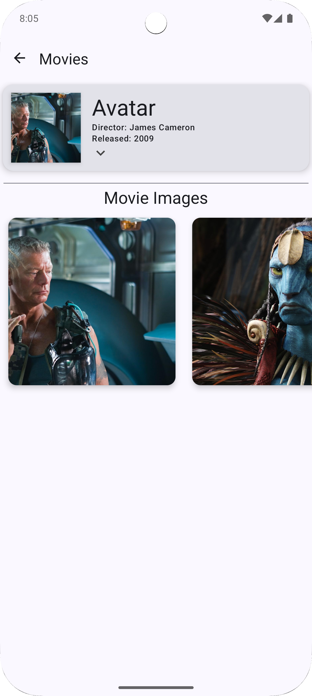

# 🎥 FilmHive - Movie App

FilmHive is a beautifully designed Android app built using Kotlin and Jetpack Compose. It allows users to browse a collection of movies, view detailed information about each movie, and explore related images. The app showcases modern Android development practices with a clean architecture and intuitive UI.

---

## 🚀 Features

- **Movie List**: Browse a list of popular movies with titles, directors, and release years.
- **Movie Details**: View detailed information about a selected movie, including the plot, director, actors, and ratings.
- **Image Gallery**: Explore high-quality images related to each movie.
- **Smooth Navigation**: Effortlessly navigate between the home screen and movie detail screen using Jetpack Compose Navigation.

---

## 📸 Screenshots

### Home Screen


### Movie Details Expanded


### On Movie Click


---

## 🛠️ Tech Stack

- **Language**: Kotlin
- **UI Framework**: Jetpack Compose
- **Image Loading**: Coil
- **Navigation**: Jetpack Navigation
- **Material Design 3**: Modern UI components and theming

---

## 📂 Folder Structure

```plaintext
com.example.filmhive
├── model               # Data classes and mock data
├── navigation          # Navigation setup for the app
├── screens             # Composable screens for Home and Details
│   ├── home            # HomeScreen.kt
│   ├── details         # DetailsScreen.kt
├── ui.theme            # Custom themes and color definitions
├── widgets             # Reusable UI components like MovieRow
└── MainActivity.kt     # Entry point for the app
```

## Clone the Repository
To get a local copy of the project up and running, clone the repository:
```bash
git clone https://github.com/MohammedYusuf-123/FilmHive.git
cd filmhive
```

---

## Contributions are welcome! Follow these steps to contribute:
	1.	Fork the Repository: Click the “Fork” button on GitHub.
	2.	Create a Branch: Create a new branch for your feature:
			git checkout -b feature/your-feature
	3.	Commit your changes and push to your fork:
			git commit -m "Add your message here"
			git push origin feature/your-feature
	4.	Open a pull request with a detailed description.
